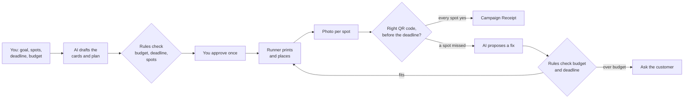
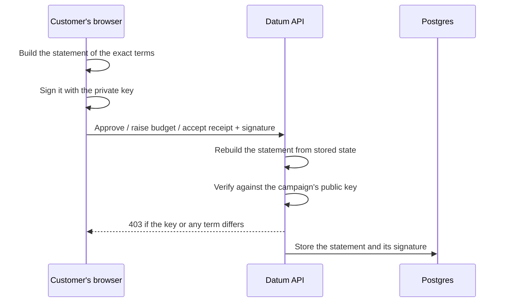
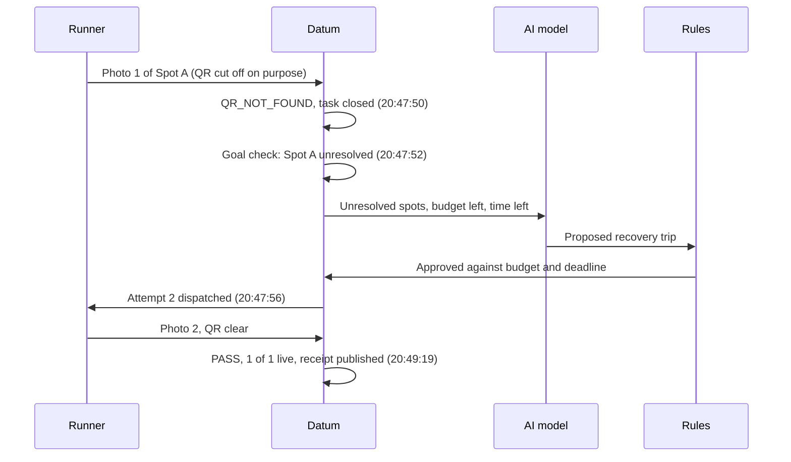
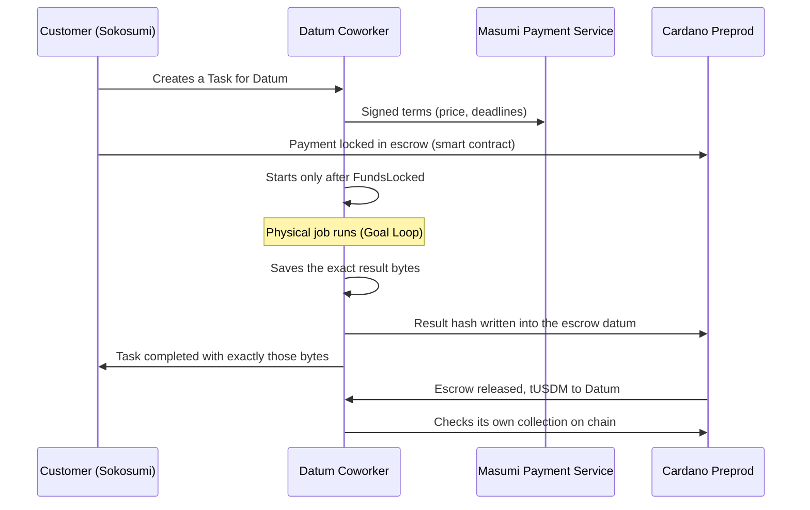
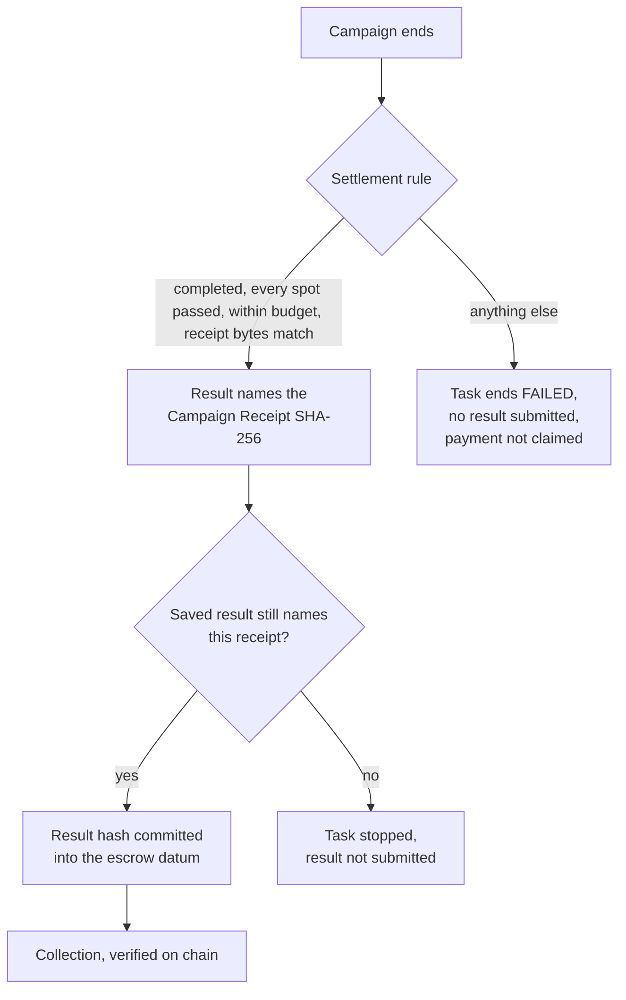
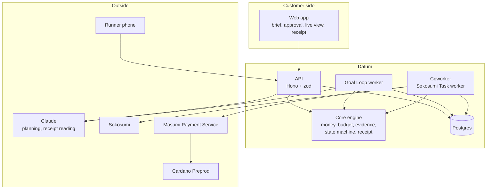

# Datum

**You set the goal. Datum gets the campaign live.**

[](https://github.com/Enoch208/datum-coworker/actions/workflows/ci.yml)
[](LICENSE)
[](#datum-is-hired-and-paid-on-cardano)

Datum is an AI Coworker that gets small real-world jobs done. Say you want QR posters put up in a few places before a deadline, on a budget. You tell Datum what, where, by when and how much, and you approve one plan. Datum gets the posters printed and placed, checks a photo of each one, fixes any that were missed, and keeps going until every spot is proven live or it reaches the limits you set. It is hired and paid on Cardano.

**Live:** [usedatum.xyz](https://usedatum.xyz) · **A real finished job:** [its Campaign Receipt](https://usedatum.xyz/campaigns/cmp_d1tmstsxkymtjp7n/receipt) · Built for TOKEN2049 Origins 2026 (Cardano / Masumi / Sokosumi Coworker track).
demo: https://youtu.be/BlrdzPOo0QI
## See it in 60 seconds

| You want to know                                 | Where to look                                                                                                                                           |
| ------------------------------------------------ | ------------------------------------------------------------------------------------------------------------------------------------------------------- |
| Does it work end to end?                         | [A real founder's job, finished 1/1](https://usedatum.xyz/campaigns/cmp_d1tmstsxkymtjp7n/receipt), with a failed first photo and an automatic recovery  |
| Is the Cardano part real?                        | [The on-chain table below](#datum-is-hired-and-paid-on-cardano): escrow, result hash and collection, each a Preprod transaction                         |
| Is the AI doing something that matters?          | [The recovery](#the-first-real-job): the model proposed the fix, deterministic rules approved it, and it reached the runner four seconds after the miss |
| Can it be paid for work it did not finish?       | [No](#paid-only-for-a-verified-outcome). Payment is claimed only for a completed campaign whose Campaign Receipt hash is the committed result           |
| What stops the AI from overreaching?             | [Rules it cannot change](#what-the-ai-can-and-cannot-do): it proposes, deterministic code approves or rejects every action                              |
| Who can approve, spend more or accept a receipt? | [Only the customer's key](#signed-by-the-customer): every such decision is a signature over the exact terms, re-verifiable by anyone                    |
| Can I trust the numbers?                         | Every number on the receipt is built from stored records and carries a SHA-256 of its canonical bytes                                                   |
| Where does it go next?                           | [The roadmap](#what-comes-next): more runners, more kinds of physical jobs, every hire settled on Cardano                                               |

## Why

A small physical job is too small for an agency and too fiddly to do yourself. The work is easy. The coordination is not: briefing someone, getting proof, noticing the spot that got missed, fixing it, and keeping the spend inside a limit. Existing worker platforms run a task you already defined. Datum starts one level higher, with the goal, and keeps going until the goal is true.

## How it works: the Goal Loop



- **AI suggests, rules decide.** The model drafts copy and plans and proposes each recovery. Deterministic code checks the spots, the copy, the budget and the deadline, prices every step from explicit rates, and makes every state change. The model never does money arithmetic and never decides whether a spot is live. If the model is down or its plan fails the rules, a deterministic plan runs instead.
- **One approval locks the limits.** It stores the exact card version, the spot set, the budget, the deadline and the copy. Changing any of them needs a new approval. Going over budget stops at `NEEDS_APPROVAL` with the extra amount needed. It never silently overspends.
- **Evidence, not status.** Each spot has its own QR code. A spot counts only when a photo sent through its open task, before the deadline, decodes to that spot's code. The server reads the QR and records every check and the reason for each verdict.
- **Cost from receipts.** A purchase is confirmed only when the receipt reader takes the photo for a purchase receipt with nothing doubtful on it and the amount read matches the amount entered. Anything else is disputed with the reason, never silently counted. The reader is advisory.
- **Safe to retry.** Every outside action has a deterministic key and is saved before it runs, so a restart reconciles instead of repeating.

## What the AI can and cannot do

The model proposes. It never authorizes. Every recovery it suggests goes through `validateRemediation` against the approval it was given (`RemediationAuthority`: the approved spots, card version, copy, budget position, deadline and open tasks), and each rejection has a name.

| The model tries to                             | What happens                                                                                                        |
| ---------------------------------------------- | ------------------------------------------------------------------------------------------------------------------- |
| Spend more than the remaining budget           | `NEEDS_APPROVAL` with the shortfall; nothing is commissioned                                                        |
| Act at a spot the customer did not approve     | Rejected: `SPOT_NOT_APPROVED`                                                                                       |
| Use a different card or change the public copy | Rejected: `ASSET_NOT_APPROVED`, `COPY_CHANGED`                                                                      |
| Schedule work after the deadline               | Rejected: `DUE_AFTER_DEADLINE`; after the deadline, `EXPIRED`                                                       |
| Redo a spot that already passed or is in hand  | Rejected: `SPOT_NOT_UNRESOLVED`, `SPOT_HAS_OPEN_TASK`                                                               |
| Name a price                                   | Its output is malformed and discarded; prices come from rates                                                       |
| Declare a spot live                            | Not possible: only a decoded QR in a photo through the open task passes a spot                                      |
| Mark the campaign complete or get itself paid  | Not possible: completion comes from evidence, payment from the [settlement rule](#paid-only-for-a-verified-outcome) |

Every row is an attack case in `packages/core/tests/authority.test.ts`, which also shows that a runner cannot pass a spot without its own code in a photo, that an amount counts only when a clean purchase receipt matches it, and that nobody can get Datum paid for an unfinished job. The full rule coverage is in `packages/core/tests/remediation.test.ts`, `packages/core/tests/recovery-plan.test.ts` and `apps/api/tests/goal-loop/planner.test.ts`. If the model is unavailable or its plan is rejected, a deterministic plan runs through the same validation.

## Signed by the customer

Approving a plan, raising the budget and accepting a disputed receipt are the only ways authority changes hands, and each one is a signature only the customer can produce. When a campaign is created, the customer's browser generates an ECDSA P-256 key pair. Only the public key reaches Datum; the private key stays in the browser and in the customer's private owner link.



- **What is signed.** For an approval: the card's asset hash, the spot-set hash, the public copy, the budget, the deadline and the approver. For a budget raise: the new budget and the approval it replaces. For a disputed receipt: the expense, its amount and the stated reason. One function in `@datum/core` builds the canonical statement, so the browser and the server sign and check identical bytes.
- **What is refused.** A forged signature, a different key, or any change to the terms after signing gets `403` and changes nothing.
- **What anyone can check.** Each approval and intervention stores the signed statement and its signature next to the campaign's public key, so the decision can be re-verified outside Datum.
- **Hired through Sokosumi.** A campaign created from a Task has no key yet; the key that signs its first approval becomes its owner.

The signing is in `apps/web/src/lib/owner-key.ts` (WebCrypto) and the check in `apps/api/src/http/owner.ts`. `apps/api/tests/owner-authority.test.ts` attacks it with other keys, forged signatures and changed terms, and `apps/web/tests/owner-key.test.ts` proves a browser signature verifies exactly as the API checks it.

## The first real job

On 7 October 2026, Maadhav, the founder of CodeDecoders, created and approved a job on usedatum.xyz: one QR card for a spot he named at Marina Bay Sands Expo, a budget of SGD 100. A member of the Datum team did the physical work as the local enrolled runner.



| SGT      | What happened                                                                                                                                                                                                                                              |
| -------- | ---------------------------------------------------------------------------------------------------------------------------------------------------------------------------------------------------------------------------------------------------------- |
| 19:05    | Maadhav approved the plan                                                                                                                                                                                                                                  |
| 20:41    | The card was printed at home with no shop receipt. The receipt reader could not read the photo as a purchase receipt, so Datum disputed the SGD 0.50. Maadhav accepted it, which the receipt counts as one manual intervention                             |
| 20:47:18 | Spot A, first photo: the QR code was cut off on purpose, labelled on screen as a demo test. Verdict `QR_NOT_FOUND`                                                                                                                                         |
| 20:47:52 | Datum evaluated the goal, found Spot A unresolved and moved to recovery                                                                                                                                                                                    |
| 20:47:56 | The model proposed one trip, the rules checked it against the budget and the deadline, and attempt 2 was dispatched under the key `campaign:cmp_d1tmstsxkymtjp7n:spot:A:attempt:2`. No human input is recorded between detecting the miss and the dispatch |
| 20:49:19 | Attempt 2 passed. The job completed 1/1 and published its Campaign Receipt                                                                                                                                                                                 |

[The receipt](https://usedatum.xyz/campaigns/cmp_d1tmstsxkymtjp7n/receipt): first pass 0/1, 1 automatic recovery, 1 manual intervention, SGD 10.50 of physical cost recorded against the SGD 100.00 budget (the SGD 0.50 home print the customer accepted, plus two SGD 5.00 agreed runner fees, which are owed at an agreed rate and carry no receipt), 1 QR scan, SHA-256 `bfa8a63d33b2d14580fe0ca3b9ccda7a084f6d7eb67cafc3e5d6013a0e1793bf`. This job was created on the website, not hired through a Sokosumi Task, so it carries no Masumi payment.

## Datum is hired and paid on Cardano

Masumi gives the Coworker its commercial lifecycle: signed terms, a smart-contract escrow, a committed result and settlement. Datum is a Coworker on Sokosumi. A customer hires it with a Task, the payment is locked on chain before any work starts, and Datum is paid in tUSDM, a Cardano native token, after it commits its result.



| Cardano feature                | How Datum uses it                                                                                         |
| ------------------------------ | --------------------------------------------------------------------------------------------------------- |
| Smart contract escrow (Masumi) | The customer's payment is locked on chain before Datum starts work                                        |
| eUTXO datum                    | The result hash is written into the escrow output's datum. That output is how Datum finds its own payment |
| Native token (tUSDM)           | The payment is made and collected in tUSDM                                                                |
| Agent registry                 | Datum is registered on the Masumi registry                                                                |
| Independent verification       | Datum counts itself paid only after reading the chain (see below)                                         |

Datum's first paid Sokosumi Task ran end to end on Cardano Preprod on 6 October 2026:

| Step                                          | Evidence                                                                                                                                                                                                              |
| --------------------------------------------- | --------------------------------------------------------------------------------------------------------------------------------------------------------------------------------------------------------------------- |
| Hired through a Sokosumi Task                 | Task `01a1106d-fd53-74ce-bedd-07fbd75d136c`                                                                                                                                                                           |
| Agent registered on the Masumi registry       | [8360ea9c…](https://preprod.cardanoscan.io/transaction/8360ea9c5b61a2cf643bc932ac4d13dc839a4d81e2fbc4c51d201a1705c6590b)                                                                                              |
| Buyer's payment locked in escrow              | [2f04c890…](https://preprod.cardanoscan.io/transaction/2f04c89076e7803a6e2bcf7783366c5d2beb0d1763265e2e463e7b352574938f)                                                                                              |
| Result hash committed on chain                | [1143d3ca…](https://preprod.cardanoscan.io/transaction/1143d3caa49856ef388fbffcdc2673de1c89837b25db662c7d18d19433ec2360), hash `586762430e6e389c13271a7d31307114af60ff320227eef2f4ba1dc500e7fb7e` in the escrow datum |
| Task completed with exactly the hashed result | completion event `01a11071-a9cc-70f9-aa3a-36713d0ccb84`                                                                                                                                                               |
| **Seller collected the payment**              | [0ae460f6…](https://preprod.cardanoscan.io/transaction/0ae460f6d36d76c600dd84287a9d3834754c6d9ea1e56ce3939a00c080b587f9): **+1 tUSDM** to the seller address                                                          |

Datum does not mark itself paid because a Task says COMPLETED. It verifies the collection independently: the collection transaction must spend this payment's own escrow output (the one whose datum carries the result hash), the seller's net gain of tUSDM in that transaction must cover the payment, and Sokosumi's receipt, the payment service and the chain must all name the same transaction. Printing and runner costs are ordinary expenses. They are never paid through Masumi.

### Paid only for a verified outcome

Cardano settlement is bound to the physical result. The Coworker produces a Task result only when the settlement rule passes. That result names the Campaign Receipt's SHA-256, and its own hash is what Datum commits into the escrow datum on chain.



| Situation                                                   | Datum's behaviour                                         |
| ----------------------------------------------------------- | --------------------------------------------------------- |
| Completed, every spot proven, within budget                 | Submits the receipt-bound result and collects             |
| Ran but ended `EXPIRED_INCOMPLETE`, `FAILED` or `CANCELLED` | Ends the Task `FAILED`, submits no result, claims nothing |
| A required spot never passed                                | Refused: `SPOTS_UNRESOLVED`                               |
| Recorded cost over the approved budget                      | Refused: `OVER_BUDGET`                                    |
| Stored receipt bytes changed after publishing               | Refused: `RECEIPT_ALTERED`                                |
| Saved result names a different receipt                      | Task stopped before submission: `RESULT_NOT_BOUND`        |

The rule is `settlementVerdict` in `packages/core/src/settlement.ts`, unit-tested in `packages/core/tests/settlement.test.ts`. The Coworker paths are integration-tested end to end against recorded Masumi and chain fixtures in `apps/coworker/tests/paid-campaign.test.ts`: a campaign that really completes (confirmed print receipt, every spot proven by photo) is paid, one that ran and expired ends `FAILED` without a result, and a forged result file is refused. When Datum submits no result, it cannot collect, and the escrowed payment stays under Masumi's refund rules for the buyer.

## What is built



Built and running at usedatum.xyz:

- Brief, AI-drafted proposal, rule validation, cost estimate, printable cards with one QR per spot (each card is tested to scan back to its own URL), one versioned approval.
- A phone inbox for the runner, with task pages, photo and receipt upload.
- Server-side QR reading of evidence photos, verdicts with per-check reasons, and a spend ledger.
- The Goal Loop worker. It evaluates the goal from evidence, and when a spot is missing it gives the model the unresolved spots, the remaining budget and the time left. Each campaign is claimed under a Postgres advisory lock and every action carries a deterministic key.
- The live screen, a record of why Datum took each decision, and the Campaign Receipt, stored as canonical JSON with its SHA-256.
- The Masumi seller lifecycle shown above, and the Coworker service that turns a hired Sokosumi Task into a job. It reads the brief from the Task, posts the proposal link, works only after the escrow is funded and the customer has approved, claims payment only when the settlement rule passes, names the Campaign Receipt's SHA-256 in the Task result, commits that result's hash on chain, completes the Task and verifies its own collection. A campaign that did not finish ends its Task `FAILED` without a result.
- 967 automated tests, run on every push by CI.

## What comes next

| When     | Plan                                                                                                                                              |
| -------- | ------------------------------------------------------------------------------------------------------------------------------------------------- |
| 30 days  | Five pilot jobs with founders, several spots each, printed at a shop, each hired through Sokosumi and settled on Cardano                          |
| 90 days  | More runners and local services behind the same executor interface, a spending cap enforced at the point of sale, and Tasks processed in parallel |
| 6 months | Other physical jobs a photo can prove: store checks, merch drops, venue checks, each one paid only for a verified outcome                         |

The physical side sits behind a single `PhysicalExecutor` interface, so more runners or local services can be added without changing the Goal Loop, the evidence rules, the spending limits or the receipt.

## Scope of this build

- Physical work is done by a local enrolled runner.
- Masumi pays Datum as the Coworker. Printing and runner fees are ordinary expenses in the campaign's ledger.
- A spot's evidence is its own QR code in a photo sent through its open task before the deadline.
- A failure caused on purpose in a demo is labelled on screen.
- Providers: Sokosumi and the Masumi Payment Service on Cardano Preprod, Blockfrost for chain reads, the Anthropic API for planning and receipt reading.

## Inside

A TypeScript pnpm workspace:

```
packages/core     the contract and the pure engine: money, budget, evidence, goal, state machine, recovery, receipt
packages/db       Postgres schema; invariants enforced by constraints
packages/masumi   Sokosumi and Masumi clients, the resumable paid-Task lifecycle, on-chain verification
apps/api          campaigns, planner, cards, runners, evidence, expenses, the Goal Loop, receipts, scan redirects
apps/worker       the durable Goal Loop process
apps/coworker     the always-on Sokosumi Coworker: hired Task → job → paid result
apps/web          the customer screens, the Campaign Receipt and the runner's phone pages
```

Stack: TypeScript, Hono, Drizzle, Postgres, React, Vite, Tailwind. Claude for planning and receipt reading. Masumi and Sokosumi on Cardano Preprod.

## Running it locally

Node 24, pnpm 10, Postgres 17 (`pnpm db:up` uses Docker).

```
pnpm install
cp apps/api/.env.example apps/api/.env      # fill in the values
pnpm db:migrate
pnpm dev                                    # API and web
pnpm test
```

Open http://localhost:5180. As in production, the web server proxies `/api` (prefix stripped), `/c/`, `/assets/cmp_` and `/evidence/` to the API on port 8790, so `APP_BASE_URL` is the web origin, `http://localhost:5180`, and every QR code, card link and runner link works through it.

## License

[MIT](LICENSE)
